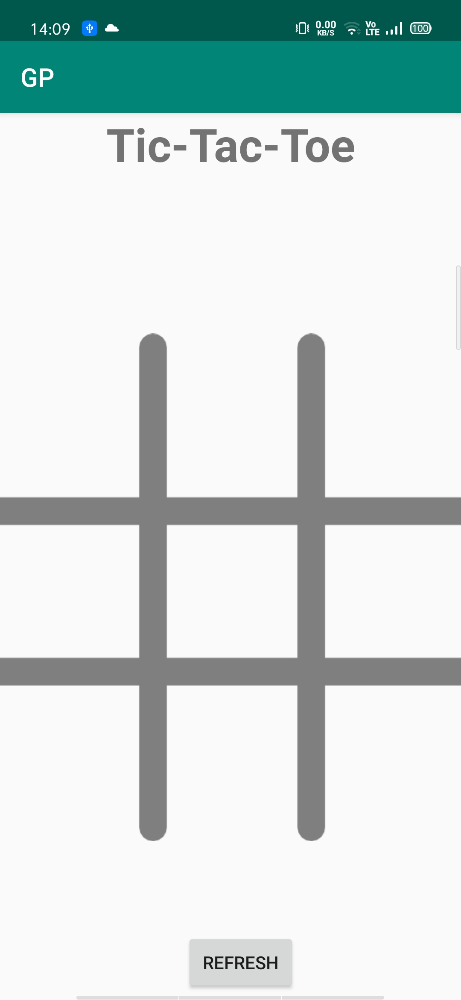
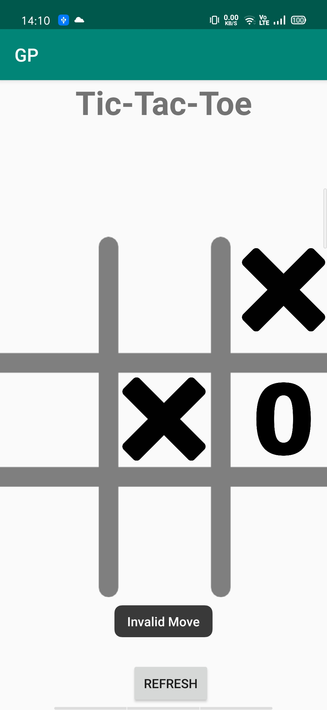

<h1>Landing Page</h1>

<h1>Invalid Move</h1>

<h1>Win</h1>

<h2>Description</h2>
<h4>I made this application using Android Studio. This is a simple multiplayer game. I developed this app during the Quarantine peroid and this is my first application, soo enjoy this app and dont forget it to rate it according to your experince. </h4>
